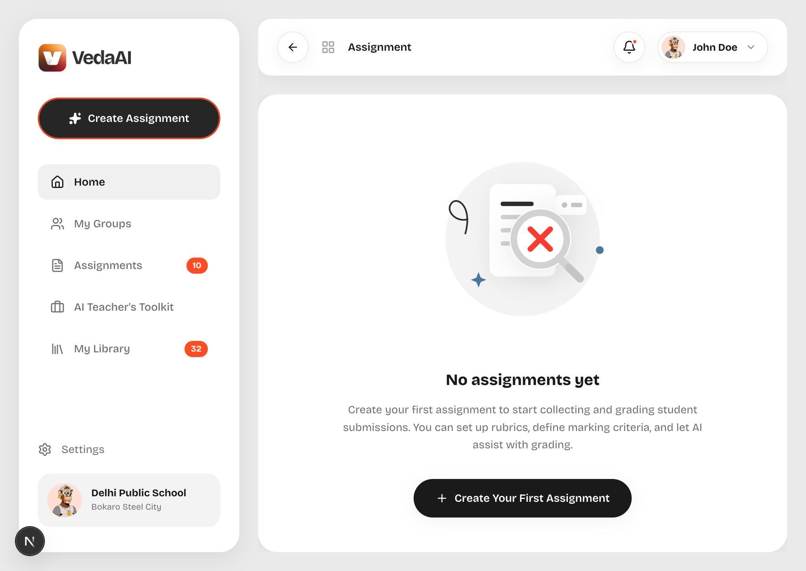
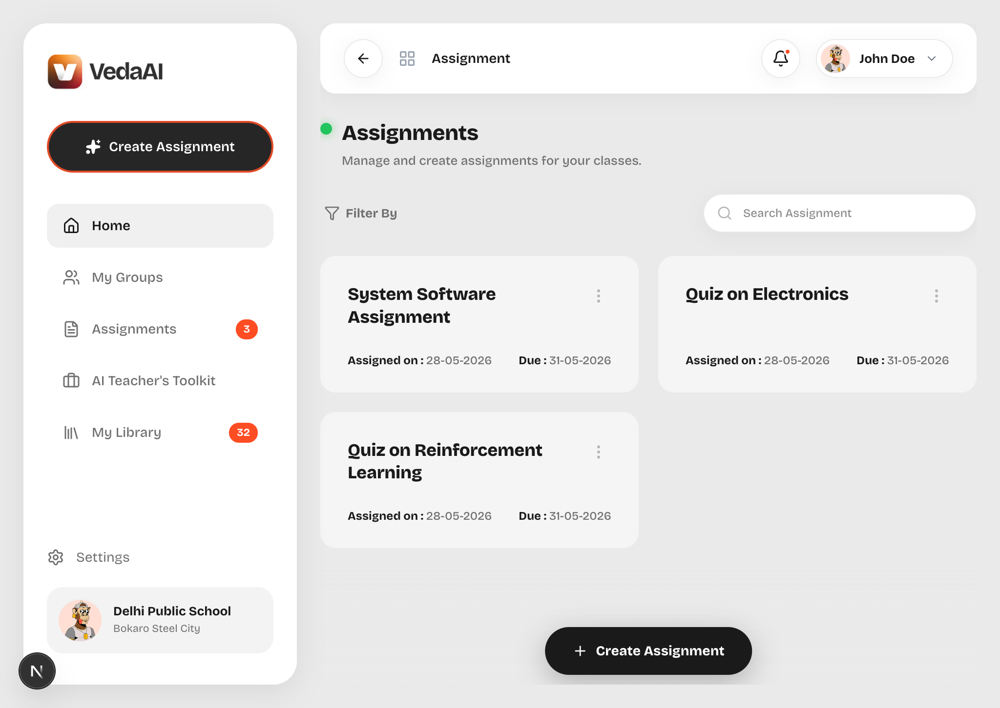
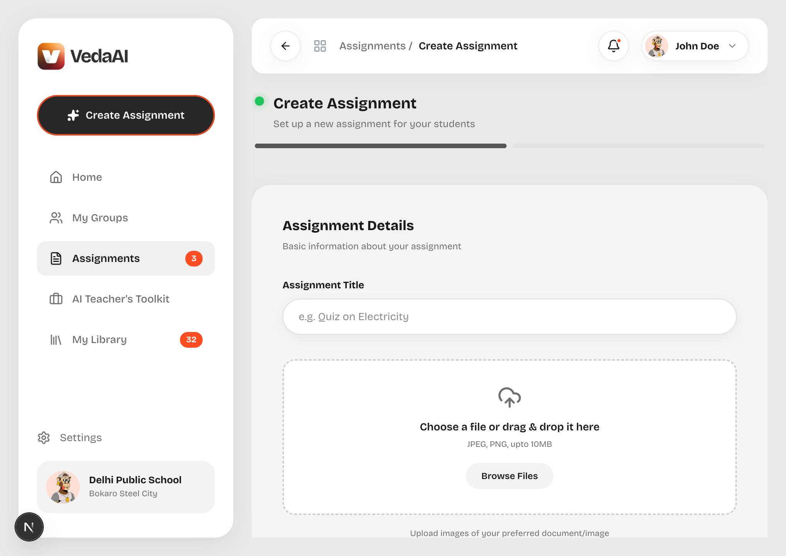
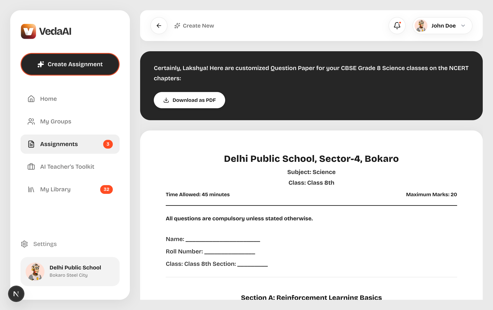
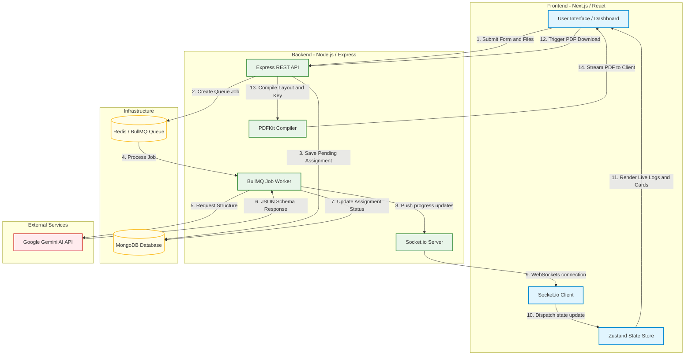

# VedaAI - AI Assessment Creator

VedaAI is a pixel-perfect, responsive AI-powered assessment creator designed to assist teachers in generating formatted question papers from uploaded documents or text prompts. It includes dynamic answer keys, live log streaming, and automated PDF compile engines.

---

## My Approach & Technical Philosophy

In building VedaAI, I focused on three core engineering pillars:
1. **Resilience & Scalability**: Long-running network tasks like AI generation cannot reliably live inside standard HTTP request-response cycles due to server timeouts. I designed an asynchronous background queue system using **BullMQ** and **Redis** to offload tasks, keeping the HTTP layer responsive.
2. **Interactive Real-Time Feedback**: Instead of showing a generic loading spinner, I leveraged **Socket.io** to stream step-by-step progress logs from the background worker directly to the teacher's dashboard, providing a terminal-like progress console.
3. **Structured & Predictable AI Output**: Using the latest Google Gen AI SDK, I enforced strict JSON schemas on the Gemini model. This guarantees that the AI outputs well-structured questions, tags, and answers, preventing runtime JSON parsing failures.

---

## User Interface & Mockup Previews

Here are the placeholders for the primary interfaces of the application:

### 1. Dashboard & Empty State
This screen is displayed when a teacher has no assignments created yet.



### 2. Assignments List Dashboard
The active dashboard displays generated question papers with options to view, download, or delete them. It features a progressive fading blur scroll overlay at the bottom.



### 3. Creation Wizard
The multi-step wizard where teachers input the assignment title, select the grade/subject, choose the question distributions, write custom instructions, and drag-and-drop reference files.



### 4. Interactive Paper Previewer
The previewer displays the generated question paper. It contains a dynamic role toggle to swap between the **Student View** (blank lines for answers) and **Teacher View** (displaying answers and solutions).



---

## System Architecture

The following diagram illustrates how the frontend components, API endpoints, background worker queue, database, and Gemini API interact:



---

## Core Logic & Implementation Details

### 1. Frontend & Client State Management (`frontend/`)

- **Zustand State Store (`src/store/useAssignmentStore.ts`)**: I implemented a centralized Zustand store to manage the application state. It holds the assignments list, tracks the active navigation view (`dashboard` | `create` | `view`), binds form inputs in the wizard, and handles asynchronous API calls for fetching, deleting, and regenerating assignments.
- **WebSocket Connection (`src/hooks/useWebSocket.ts`)**: When an assignment is being generated, the client joins a Socket.io room matching the assignment ID. This custom hook listens for `assignment:status` events, streaming logs and updating the global state when the generation is completed or fails.
- **Glassmorphic Layout & Progressive Blur Overlay (`src/app/globals.css`)**: 
  - I created a vanilla CSS design system incorporating premium glassmorphic cards and floating header elements.
  - To replicate the Figma scrolling effect, I placed a sticky/absolute container (`.dashboard-bottom-blur-container`) containing a linear-gradient and a `backdrop-filter: blur(8px)` with a progressive `-webkit-mask-image` gradient mask. This blurs and fades out the assignment cards as they scroll underneath the floating "Create Assignment" button.
  - To ensure that the header and search filter do not shrink when the card list scrolls, I defined them with `flex-shrink: 0`, locking them in place at the top of the viewport.

### 2. Backend Ingestion & Routing (`backend/`)

- **Multer Middleware Ingestion**: Files uploaded via the creation wizard are processed using Multer and saved locally in the `uploads/` directory.
- **REST API Routes (`src/routes/assignmentRoutes.ts`)**:
  - `POST /api/assignments`: Receives form inputs and files, creates a database record, pushes a job to BullMQ, and immediately returns a `202 Accepted` response.
  - `GET /api/assignments`: Returns a list of all assignments.
  - `GET /api/assignments/:id/download`: Streams the generated PDFKit compiled document back to the client browser.

### 3. Asynchronous Task Queue (`BullMQ + Redis`)

- **Worker Instantiation (`src/queues/questionWorker.ts`)**: The background process acts as a consumer for the BullMQ `question-generation` queue. It parses reference files (such as PDFs, TXT, or DOCX documents) and formats a structured prompt.
- **Dynamic Redis Config (`src/config/redis.ts`)**: I configured the Redis setup to handle both local and cloud environments. It parses a single `REDIS_URL` connection string using the Node.js `URL` API, extracting host, port, credentials, and automatically enabling `tls` settings with `rejectUnauthorized: false` for secure connection protocols (`rediss://`) on services like Upstash or Render Redis.

### 4. Structured AI Generation (`Gemini API`)

- **Strict JSON Schemas**: In `src/services/aiService.ts`, I set up the Gemini client with response schemas. By providing the model with a nested schema structure, the output from `gemini-2.5-flash` is guaranteed to match the expected typescript interfaces:
  ```typescript
  interface IAssignment {
    title: string;
    grade: string;
    subject: string;
    sections: {
      title: string;
      questions: {
        questionText: string;
        marks: number;
        options?: string[]; // for MCQs
        solution: string;
      }[];
    }[];
  }
  ```

### 5. Document Compilation (`src/services/pdfService.ts`)

Instead of using basic HTML-to-PDF generators, I built a custom PDF compiler using **PDFKit** to ensure high-fidelity layout styling:
- **Markdown Formatting Engine**: I wrote a parser that scans text for markdown bold syntax (`**text**`). It splits sentences into segments and dynamically switches between `Helvetica` and `Helvetica-Bold` inline, rendering formatted text without breaking line wraps.
- **Automatic Page Breaks & Spacers**: It calculates content height, adds page breaks before sections when running out of vertical space, and draws clean answer guidelines (ruled lines) for the student view.
- **Role-Based Compilation**: The PDF builder generates two versions of the document based on the `role` parameter:
  - `student`: Displays sections, questions, and blank answer slots.
  - `teacher`: Embeds an **Answer Key** section at the bottom, mapping questions to their solutions and marks.

---

## Extra Features Implemented

Beside the core project requirements, I built several key enhancements to improve usability and production readiness:
* **Inline Markdown Renderer**: In the interactive review screen, I wrote a custom React component that formats text on the fly, rendering bold tags (`**`) inline.
* **Dual-Role View Switcher**: Built a custom slider toggle in the previewer that lets teachers preview the student's layout vs. the teacher's key layout before downloading.
* **Active Sidebar Selector Sync**: The navigation system automatically updates highlighters, ensuring the "Home" option is only highlighted when on the dashboard, and keeping "Assignments" active when creating or previewing papers.

---